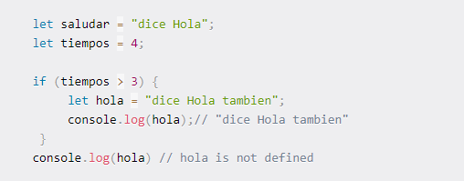

## Que es JavaScript
Es un lenguaje de programación interpretado, dialecto del estándar ECMAScript. Se define como orientado a objetos,2​ basado en prototipos, imperativo, débilmente tipado y dinámico. Todos los navegadores modernos interpretan el código JavaScript integrado en las páginas web. Para interactuar con una página web se provee al lenguaje JavaScript de una implementación del Document Object Model (DOM). 

Es una de las tecnologias centrales de la World Wide Web, junto con HTML y CSS. Con este es posible agregar funcionalidad a las paginas web permitiendo mejoras en la interfaz, como son los botones, los clicks, slides, entre otras funciones. JS actualmente no esta orientado solo al lado del cliente. Tambien se puede usar en el lado del servidor con Node.js o en el area mobile como lo es Electron.

## Variables

 Para almacenar y representar esta información en el código base de JavaScript, utilizamos variables. Una variable es un contenedor para un valor.

 Js tiene tres tipo de variebles:

   - **Var**: son variables globales o locales, estas se pueden volver a declarar y modificar. 
   
   
   
            Actualmente con ES6 let y const, que se pueden utilizar para la declaración de variables.
   
   - **Let**: let es ahora preferible para la declaración de variables. Tiene un ámbito de bloque, este es un trozo de código delimitado por {}. Un bloque vive entre llaves. Todo lo que está dentro de llaves es un bloque.

   *let puede modificarse pero no volver a declararse.*

   por ejemplo:

    <Bien>
            let saludar = "dice Hola";
            saludar = "dice Hola tambien";
    </Bien>
    
    <Mal>
        let saludar = "dice Hola";
        let saludar = "dice Hola tambien"; // error: Identifier 'saludar' has already been declared
    </Mal>

   *Sin embargo, si la misma variable se define en diferentes ámbitos, no habrá ningún error:*

    <Bien>
        let saludar = "dice Hola";
        if (true) {
            let saludar = "dice Hola tambien";
            console.log(saludar); // "dice Hola tambien"
        }
        console.log(saludar); // "dice Hola"
    </Bien>
  
  ¿Por qué no hay ningún error? Esto se debe a que ambas instancias son tratadas como variables diferentes, ya que tienen ámbitos diferentes.

   
   
   - **Const**:Las variables declaradas con const mantienen valores constantes (como lo dice el nombre xd). Al igual que las declaraciones let, solamente se puede acceder a las declaraciones const dentro del bloque en el que fueron declaradas.

   *const no puede modificarse ni volver a declararse*

   <Ejemplo>
        const saludar = "dice Hola";
        saludar = "dice Hola tambien";// error: Assignment to constant variable. 
   </Ejemplo>

   <Ejemplo2>
     const saludar = "dice Hola";
    const saludar = "dice Hola tambien";// error: Identifier 'saludar' has already been declared
   </Ejemplo2>

  ## Hoisting
   es un mecanismo de JavaScript en el que las variables y declaraciones de funciones se mueven a la parte superior de su ámbito antes de la ejecución del código. 
  var se elevan a la parte superior de su ámbito y se inicializan con un valor de undefined.

  Al igual que  var, las declaraciones let se elevan a la parte superior. A diferencia de var que se inicializa como undefined, la palabra clave let no se inicializa. Sí que si intentas usar una variable let antes de declararla, obtendrás un Reference Error.